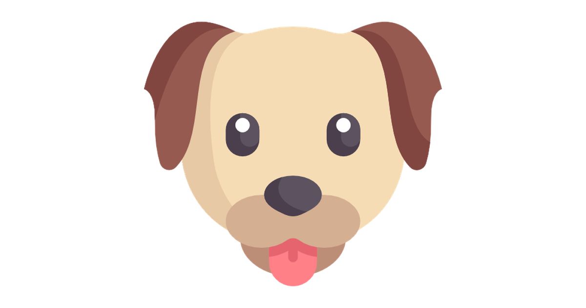

# Welcome to dog-joi-normalize 👋

[](https://github.com/jsDotx3/dog-joi-normalize#readme)
[](https://github.com/jsDotx3/dog-joi-normalize/graphs/commit-activity)
[](https://twitter.com/jsDotx3)

> Normalize error for Joi Validation in Express



### 🏠 [Homepage](https://github.com/jsDotx3/dog-joi-normalize#readme)

## Install

```sh
npm i dog-joi-normalize --save
```

## Example Response Error.
```
{
    "error": {
        "name": {
            "type": "anyRequired",
            "path": "name"
        },
         "last_names": {
            "type": "anyRequired",
            "path": "last_names"
        }
    }
}
```
For more errors, visit [Documentation Joi](https://hapi.dev/family/joi)

## Author

👤 **Jose Nuñez A**

* Website: https://twitter.com/jsDotx3
* Github: [@jsDotx3](https://github.com/jsDotx3)

## 🤝 Contributing

Contributions, issues and feature requests are welcome!

Feel free to check [issues page](https://github.com/jsDotx3/dog-joi-normalize/issues). You can also take a look at the [contributing guide](https://github.com/jsDotx3/dog-joi-normalize/blob/master/CONTRIBUTING.md).

## Show your support

Give a ⭐️ if this project helped you!


## 📝 License

Copyright © 2020 [Jose Nuñez A](https://github.com/jsDotx3).

This project is [ISC](https://github.com/jsDotx3/dog-joi-normalize/blob/master/LICENSE) licensed.
